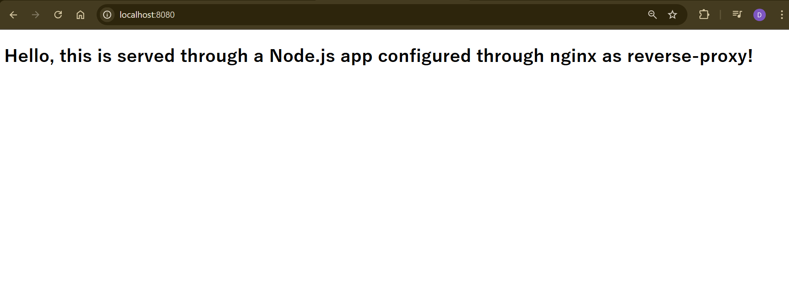

# Nginx as Reverse Proxy Demo

This repository demonstrates how to configure **Nginx** as a reverse proxy (load balancer) for three backend applications running in Docker containers.

---

## Project Setup

1. Clone the repository:  
   ```bash
   git clone https://github.com/atkaridarshan04/Nginx-ReverseProxy-Demo.git
   ```

2. Start the containerized backend applications:  
   ```bash
   docker-compose up -d
   ```

3. Test the containerized applications:  
   - Open the following URLs in your browser:
     - [http://localhost:3001](http://localhost:3001)
     - [http://localhost:3002](http://localhost:3002)
     - [http://localhost:3003](http://localhost:3003)

     

---

## Installing Nginx

1. Update your system and install Nginx:  
   ```bash
   sudo apt update && sudo apt install nginx
   ```

2. Check available Nginx options:  
   ```bash
   nginx -h
   ```

3. Start the Nginx service:  
   ```bash
   nginx
   sudo systemctl start nginx
   ```

4. Check nginx running:  
    - [http://localhost:80](http://localhost:80)

    

---

## Configuring Nginx as Reverse Proxy

1. Remove the default configuration file:  
   ```bash
   sudo rm /etc/nginx/nginx.conf
   ```

2. Edit the Nginx configuration file:  
   ```bash
   sudo vi /etc/nginx/nginx.conf
   ```

3. Paste the contents of the provided [`nginx.conf`](./nginx.conf) file into the editor.

4. Restart Nginx to apply the configuration:  
   ```bash
   nginx -s reload
   sudo systemctl restart nginx
   ```

5. Access the reverse proxy at:  
   - [http://localhost:8080](http://localhost:8080)

   

---

## Managing Nginx

### Print Logs  
View the access logs:  
```bash
tail -f /usr/local/var/log/nginx/access.log
```

### Stop Nginx  
Stop the Nginx service:  
```bash
nginx -s stop
```

---

## Additional Notes

To edit the default Nginx index page:  
```bash
sudo vi /var/www/html/index.nginx-debian.html
```

---
