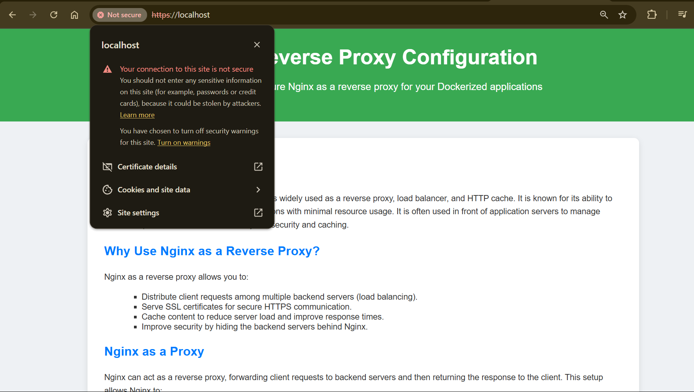

# Nginx as Reverse Proxy Demo

This repository demonstrates how to configure **Nginx** as a reverse proxy (load balancer) for three backend applications running in Docker containers.

---

## Project Setup

1. **Clone the repository:**  
   ```bash
   git clone https://github.com/atkaridarshan04/Nginx-ReverseProxy-Demo.git
   ```

2. **Start the containerized backend applications:**  
   ```bash
   docker-compose up -d
   ```

3. **Test the containerized applications:**  
   Open the following URLs in your browser to verify the backend services:  
   - [http://localhost:3001](http://localhost:3001)  
   - [http://localhost:3002](http://localhost:3002)  
   - [http://localhost:3003](http://localhost:3003)

   

---

## Installing Nginx

1. **Update your system and install Nginx:**  
   ```bash
   sudo apt update && sudo apt install nginx
   ```

2. **Check available Nginx options:**  
   ```bash
   nginx -h
   ```

3. **Start the Nginx service:**  
   ```bash
   nginx
   sudo systemctl start nginx
   ```

4. **Verify Nginx is running:**  
   Open [http://localhost:80](http://localhost:80) in your browser to see the default Nginx page.  

   

---

## Configuring Nginx as a Reverse Proxy

1. **Remove the default configuration file:**  
   ```bash
   sudo rm /etc/nginx/nginx.conf
   ```

2. **Generate SSL certificates:**  
   Create a directory for Nginx certificates and generate a self-signed SSL certificate.  
   ```bash
   mkdir ~/nginx-certs
   cd ~/nginx-certs
   ```

   ```bash
   openssl req -x509 -nodes -days 365 -newkey rsa:2048 -keyout nginx-selfsigned.key -out nginx-selfsigned.crt
   ```
   

   **Note:** Adjust the certificate file paths in the Nginx configuration file ([nginx.conf](nginx.conf)) as per your setup.

4. **Paste the Nginx configuration file contents:**  
   ```bash
   sudo vi /etc/nginx/nginx/conf
   ```
   Place the content form [`nginx.conf`](./nginx.conf) file in `/etc/nginx/nginx/conf`

5. **Restart Nginx to apply the configuration:**  
   ```bash
   nginx -s reload
   sudo systemctl restart nginx
   ```

6. **Access the reverse proxy:**  
   - [http://localhost:80](http://localhost:80)  
   - [https://localhost:443](https://localhost:443)  

     
     


   **Note:** As this is a self-signed SSL certificate, your browser may show a "not secure" warning.

---

## Managing Nginx

### **View Logs**
To view the Nginx access logs:  
```bash
tail -f /usr/local/var/log/nginx/access.log
```

### **Stop Nginx**
To stop the Nginx service:  
```bash
nginx -s stop
```

---

## Additional Notes

- To edit the default Nginx index page:  
  ```bash
  sudo vi /var/www/html/index.nginx-debian.html
  ```

- Ensure that the self-signed certificates are used only in testing or development environments.

---